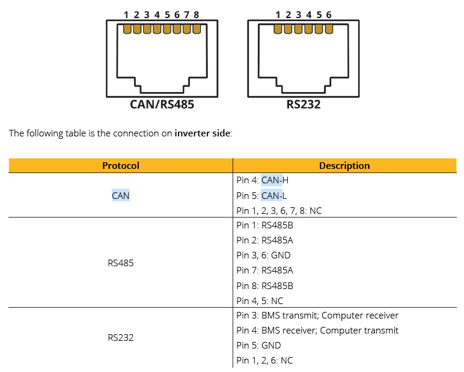
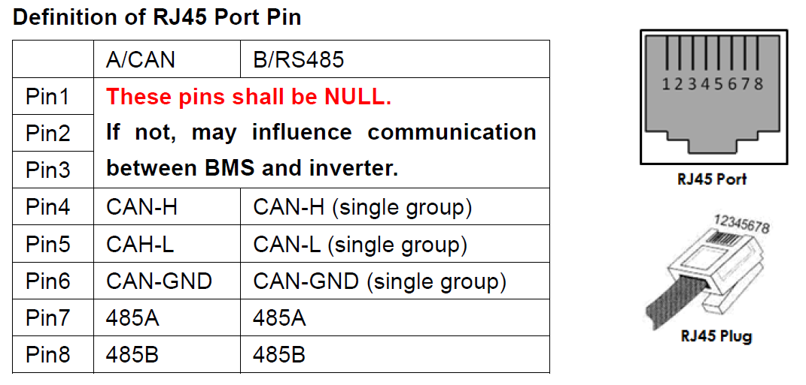
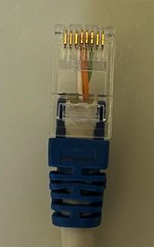

I was trying to buy this cable from the official supplier but they did not have it available. Looking online I could not find a reliable source. I ended up following some guidance from [Powerforum.co.za](https://powerforum.co.za/topic/11977-sunsynk-88-with-pylontech-us3000c-bms-cable/) but this was still a bit unclear. Ultimately I referenced the manuals for the battery and the inverter for the pinouts to crimp my own cable.

Canbus uses three cables for communication CAN-H, CAN-L and GND. A common GND is needed to ensure the CAN-H and CAN-L is referenced off a common potential difference. You basically need to connect CAN-H on the battery to CAN-H on the inverter, CAN-L on the battery to CAN-L on the inverter and GND on the battery to GND on the inverter.

**From the Sunsynk 5.5kw manual v20**

**From the pylontech US3000C manual 20CQSV1103**

As you can see in these figures both have Pin 4 as CAN-H and Pin 5 as CAN-L and the battery has Pin 5 as GND but the inverter does not specify a GND pin. I scoured forums an documentation and could not get a conclusive answer. Everything pointed to the battery pinouts that are listed in the Sunsynk training manual and list CAN GND on pin 8 but the CAN-H pin is listed incorrectly.

I ended up making a cable that connects Pin 4 - Pin 4; Pin 5 to Pin 5; and Pin 6 to Pin 6 using the oreintation provided in the images from the manuals

This is what the connector looks like on both ends. Colours from left to right White-Orange, Orange, Green. It is important to note that the battery manual stipulates that pins 1 -3 should be left unconnected.

**Canbus cable Pylontech US3000C to Sunsynk 3.6kw/5.5kw**

# Notes

I tested this on SUNSYNK-5K-SG01LP1/SUNSYNK-5K-SG01LP3 but it should also be the same for SUNSYNK-3.6K-SG01LP1/SUNSYNK-3.6K-SG01LP3, SUNSYNK-3.6K-SG02LP1 since they share the same manual. The GND could be completely wrong but I have no clear indication what would be the correct pin. I emailed Sunsynk to confirm this but have yet to receive a response.

# End