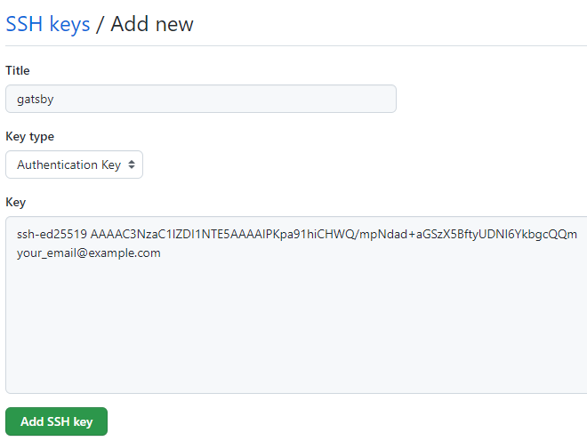
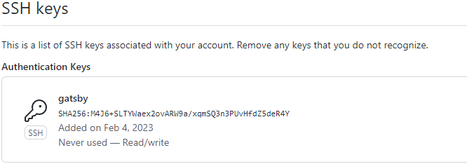

# Start
https://docs.github.com/en/authentication/connecting-to-github-with-ssh/adding-a-new-ssh-key-to-your-github-account

# Setup

## Install git

`sudo apt-get install git`

## Setup user and email

`git config --global user.name "Your Name"`
`git config --global user.email ""`

## Generate a new SSH Key

`ssh-keygen -t ed25519 -C "your_email@example.com"`

### Output
```
>>$ ssh-keygen -t ed25519 -C "your_email@example.com"
Generating public/private ed25519 key pair.
Enter file in which to save the key (/home/user/.ssh/id_ed25519): /home/user/.ssh/github
Enter passphrase (empty for no passphrase): 
Enter same passphrase again: 
Your identification has been saved in /home/user/.ssh/github
Your public key has been saved in /home/user/.ssh/github.pub
The key fingerprint is:
SHA256:dfghjkl;lkjhgfghjkl; your_email@example.com
The key's randomart image is:
+--[ED25519 256]--+
|                 |
|        2222222  |
|       11111111  |
|      .33333333  |
|   234234o=*     |
|      . o=**+    |
|       ..+==oo   |
|     23423433343 |
|     1213242*rr  |
+----[SHA256]-----+
```

## Copy public key to github

1. Open Settings

2. Click SSH And PGP

3. Click New SSH Key

4. Get the key material
**WARNING** This will show your credentials in clear text. Run this when no one can see your screen and complete until the end
`cat ~/.ssh/github.pub`

### Output
```
>>$ cat ~/.ssh/github.pub 
ssh-ed25519 AAAAC3NzaC1lZDI1NTE5AAAAIPKpa91hiCHWQ/mpNdad+aGSzX5BftyUDNl6YkbgcQQm your_email@example.com
```
5. Past the material into the box

6. Click "Add SSH Key" and confirm it is correct

7. Remove the key from the terminal
`clear`

## Configure github as a host in ssh

```
cat << EOF >> ~/.ssh/config

Host github.com
    HostName github.com
    User git
    IdentityFile "~/.ssh/github"
EOF
```

# End
